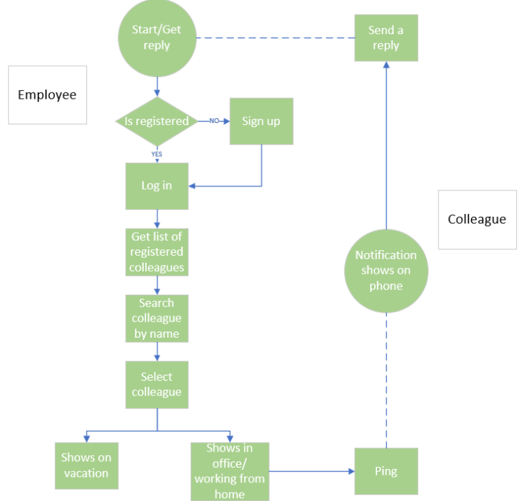

# Business Process
*You analyze and describe simple business processes that are related to your project.*

##  Business Process Model and Notation

This is a simple picture of how to business processes would take place in the Group Project.
In this diagram there are 3 roles:
- Employee: The person wanting to notify someone that they want to meet them.
- Co-worker: The person gettig the notification and responding.
